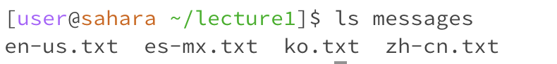

cd commands:

  (1)An example of using the command with no arguments:

  

  The working directory when the command runs is the root.
  
  There is no output because cd means change directory, but with no argument, the terminal will not change the directory(stay the same).

  The output is not an error.

  (2)An example of using the command with a path to a directory as an argument:

  

  The working directory when the command runs is now in lecture1.

  The directory is new changing from root to lecture1 since the cd command changed the previous directory into the argument we typed in as a new   directory we are working on (if it exists).

  The output is not an error.

  (3)An example of using the command with a path to a file as an argument:

  

  Even though I put en-us.txt as an argument, but the directory when the command runs is still the messages directory.

  The directory is not changing because there is no such directory that matches my input argument, so it will remain in the current directory.

  The output is an error, this is because en-us.txt is a file that cannot be used as a directory to change. So the change directory command is     not applied.

ls command:

  (1)An example of using the command with no arguments:

  

  The working directory when the command runs is the root.

  The output is lecture1. Because the ls command lists all files(subdirectories) in the current directory which is currently the root directory.

  The output is not an error.

  (2)An example of using the command with a path to a directory as an argument:

  

  The working directory when the command runs is the lecture1.

  The output is all file names in the messages. This is because when we are taking a directory(under the current directory) as an argument, the    ls command will list all files in that argument directory.

  The output is not an error.

  (3)An example of using the command with a path to a file as an argument:

  

  The working directory when the command runs is the messages directory.

  The output repeats the input file path argument. Not like taking the directory as an argument, the ls command only displays the information      about the file when taking the file path as an argument. That is why it repeats the input file.

  The output is not an error.

cat command:

  (1)An example of using the command with no arguments:
  
  
  
  The working directory when the command runs is the root.

  There is no output because when the cat command does not contain any arguments, it waits for input from my keyboard.

  The output is not an error.

  (2)An example of using the command with a path to a directory as an argument:

  
  
  The working directory when the command runs is the root.

  The output says cat: lecture1: is a directory. This is because the cat command reads data from files, not directories. So the input argument     is irrelevant.

  The output is an error because the cat command cannot take a directory as an argument(only files).

  (3)An example of using the command with a path to a file as an argument:

  

  The working directory when the command runs is the messages directory.

  The output is the lines inside of the file argument. Because the cat command reads data from the file and gives its content as output.

  The output is not an error.
