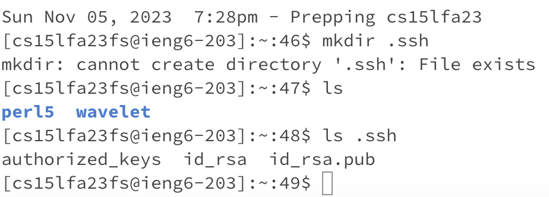
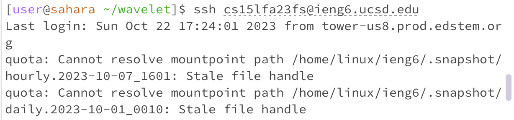

Part1:

For Part, I have created a StringServer.java file, which concatenates strings to each other, which are being inputted in the query of the server.

Then in the URL, add /add-message?s=Hello  I got 

handleRequest in Handler class that takes a URI as an input. By adding Hello in the query in my code I changed the variable word , which
I declared to be empty unless there is an input in the query. So, by the time return word line in my code ran, word was equal to “Hello” (word= Hello).
I am handling the query in handleRequest method in Handler class and the method’s argument is input of type URI. There were some methods that helped reach the goal of this Lab Report. In my code I used getPath() and getQuery methods from URI.class . Moreover, I used contains() (takes in parameter of type CharSequence) and
split() (takes a character of a string as an argument) method from String.class.

Then I change /add-message?s=Hello to /add-message?s=How are you

I am still handling the query in the handleRequest method in the Handler class and the method’s argument is input of type URI.
By adding How are you to the query, nothing in my code changed, but the counter variable int num (which became num++) and the
String word, to which “How are you” was concatenated. As I said, I am handling the query in handleRequest method in Handler class and
the method’s argument is input of type URI. There were some methods that helped reach the goal of this Lab Report. In my code I used
getPath() and getQuery methods from URI.class . Moreover, I used contains() (takes in parameter of type CharSequence) and
split() (takes a character of a string as an argument) method from String.class.

Part2:
Private key:

Public Key:

No password required:

Part3:

Weeks 2 and 3 were very informative and educational. I learned how to create a server and perform various operations by utilizing the path, query, and Java code.  Also, the ssh key with no password required for logging into a course-specific account is very useful. Everything I have learned so far has already helped me in the CSE12 class and I’m sure will be handy in my future career!
