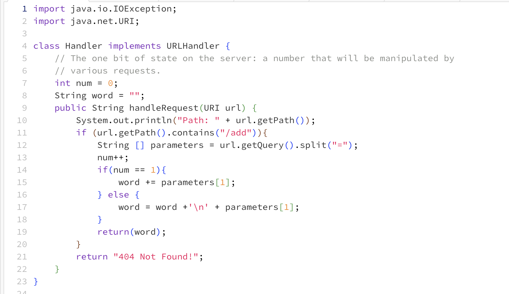
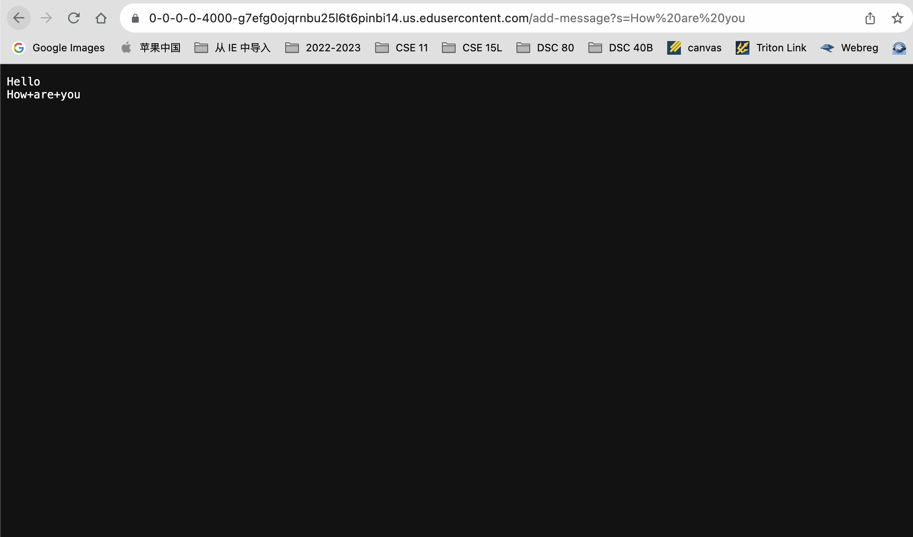

Part1:

For Part, I have created a StringServer.java file, which concatenates strings to each other, which are being inputted in the query of the server.

Then in the URL, add /add-message?s=Hello  I got 

Here I called the method handleRequest in the Handler class that takes a URI as an input. By adding Hello in the query in my code I changed the variable word, which
I declared it to be empty unless there is an input in the query. So, by the time the return word line in my code ran, the word was equal to “Hello”

Then I change /add-message?s=Hello to /add-message?s=How are you

I am still handling the query in the handleRequest method in the Handler class and the method’s argument is input of type URI.
By adding "How are you" to the query, the variable int num (which became num++) and the String word, which became “How are you”. There were some methods that helped reach the goal of this Lab Report. In my code I used getPath() and getQuery methods from URI.class. Moreover, I used the contains() and split() methods from the String. class. 

Part2:
