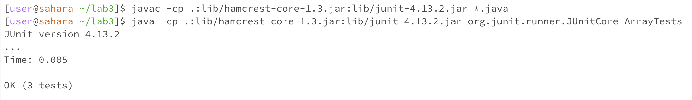

Array Methods

I'll provide an example of a bug from week 4's lab and follow the requested format for a failure-inducing input, a non-failure-inducing input, symptoms, bug, and a code change to fix the issue. 

I'll consider a bug in a hypothetical Java program where a method to calculate the average of an array of integers, `averageWithoutLowest`, has a bug. The bug is that it does not correctly exclude the lowest element when calculating the average.

Failure-Inducing Input:

JUnit Test for the Bug:
```java
@Test
public void testReverseInPlace_Bug() {
    int[] inputArray = {1, 2, 3, 4, 5};
    ArrayExamples.reverseInPlace(inputArray);
    assertArrayEquals(new int[]{5, 4, 3, 2, 1}, inputArray);
}
```

JUnit Test for the no Bug:
```java
@Test
public void testReverseInPlace_Bug() {
    int[] inputArray = {1, 2, 3, 4, 5};
    ArrayExamples.reverseInPlace(inputArray);
    assertArrayEquals(new int[]{5, 4, 3, 2, 1}, inputArray);
}
```
Symptom:

With bug:


No bug:


Fix the bug:

The code before with the bug is 

```java
  static void reverseInPlace(int[] arr) {
    for(int i = 0; i < arr.length; i += 1) {
      arr[i] = arr[arr.length - i - 1];
    }
  }
```

The correct code should be:
```java
static void reverseInPlace(int[] arr) {
    int n = arr.length;
    for (int i = 0; i < n / 2; i++) {
        int temp = arr[i];
        arr[i] = arr[n - i - 1];
        arr[n - i - 1] = temp;
    }
}
```

Explanation:

The old code attempted to reverse the input array in place but had a logical error in the loop. The problem was that it overwrote the values in the original array with reversed values incorrectly.

But the new code:
It introduces a variable n to store the length of the array, which simplifies the code and avoids recomputing the length in each iteration.

It uses a for loop to iterate from the beginning of the array to halfway. This is because when you swap the first half of the array with the second half, you effectively reverse the entire array.

Inside the loop, it uses a temporary variable temp to store the value at the current index i. This is necessary to ensure that values aren't lost during the swapping process.

It swaps the value at index i with the corresponding value at index n - i - 1, effectively reversing the values in the array.


Part2:

I will work with the grep command. I will show you 4 variations and alternate ways to use this command.

grep -r -1

Analternative way to find the file that contains the string “fall had been” in the data directory is to use grep -r -l "fall had been" .


The -r flag is used to look through all of the subdirectories to find a specific pattern. The -l flag is used to print the names of the files
where the pattern (in our case “fall had been”) is found. Combining them returns the path to all files where the string “fall had been” is. (in our
case it’s chapter-9.txt).


Or, for example, the pattern “as its fall had been” can be found in these files.

grep - n


This grep command with the -n flag not only finds the occurence of a pattern in a given file, but also prints the line where this pattern is.


We can use this command to search for a pattern in all text of a given directory.


grep - w


This grep command variation with a -w flag finds the actual pattern (in our case “fall”) instead of finding also the modifications of this
word. For example, the $ grep -n "fall" chapter-9.txt command would print lines that contain words fall as well.


The flags -r , -l , -w and many others can be combined. For example, in this case the output is the paths to all .txt files in all the
subdirectories that contain the pattern “fall” and only “fall”.


grep -c 


Here, the -c flag prints how many occurences of a pattern (in our case “fall”) is in chapter-9.txt and the paths to the files. 


Here, we are trying to find the pattern “report” in chapter-9.txt files As we can see there is 37
occurrence of “report” in the txt file
