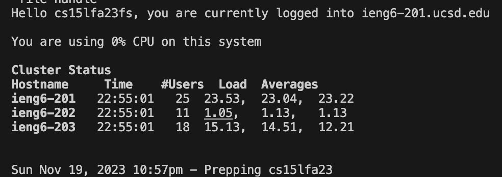
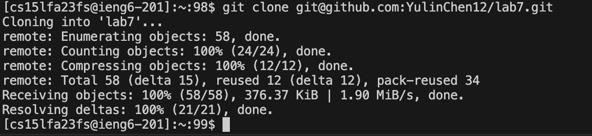
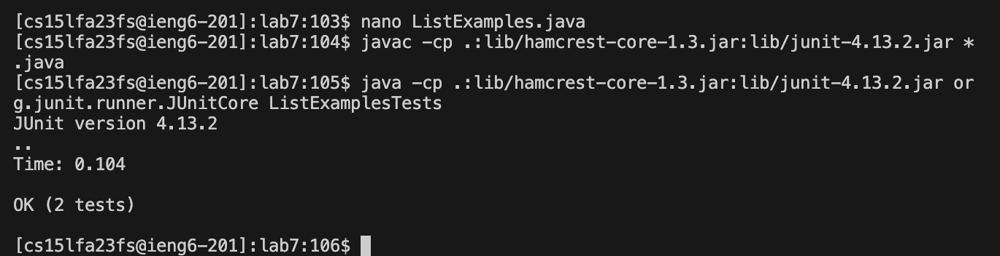

Step 1 for Lab4: Login in to ieng6:

Login in to the ieng6 using username and password

Step2: Clone the repository from Github account (using the SSH URL):

Use git clone to the SSH link on Github.

Step 3: Compile and Run the java test:

cd into the lab7 directory, compile and run the java test. We see they are two errors.

Step4: Edit the code file ListExamples.java to fix the failing test

I change the index1 to index2,this will make the code run with no errors.
Press ctrl + x to exit the file reading, then press Y and enter to save the file.

Step5: Run the tests, demonstrating that they now succeed

Compile and run the java test again.
Now all test is passing.

Step6: Commit and push the resulting change to your Github account

Use git add and commit the change, then push into the github

Now we can see the correct code in the github.
