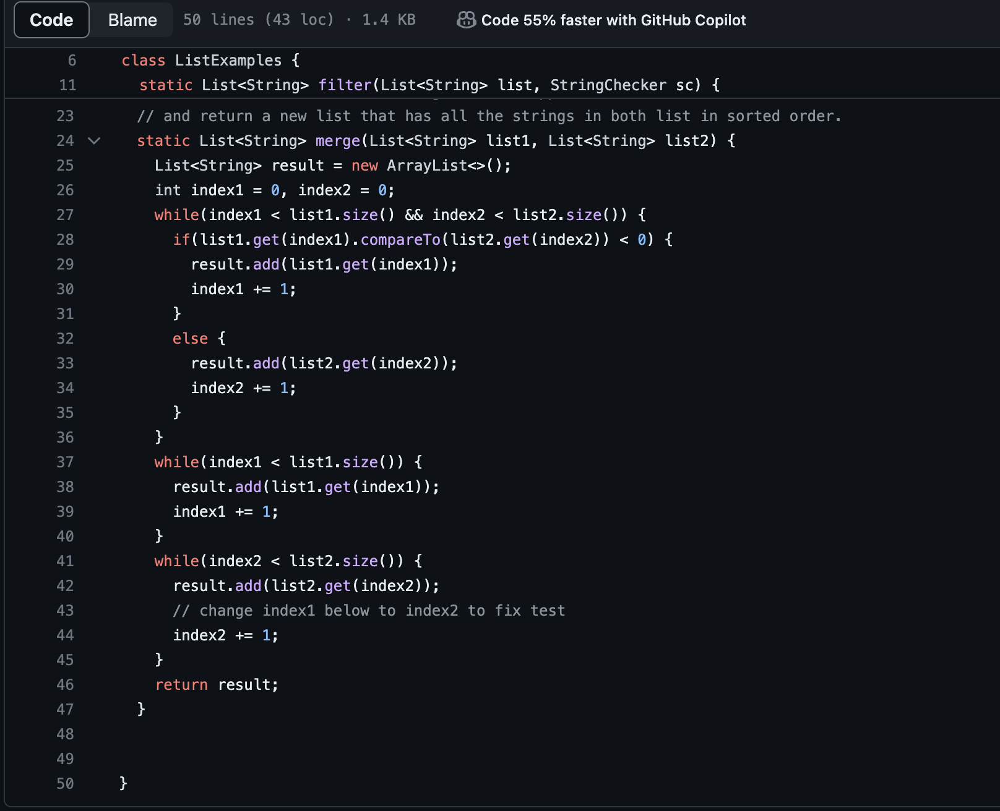

Step 1 for Lab4: Login in to ieng6:

Login in to the ieng6 using username and password

First,put in the command ssh <space> cs15lfafs@ieng6@ucsd.edu
then press enter

Then I entered my password and login in successfully.

Step2: Clone the repository from Github account (using the SSH URL):

Use git clone to the SSH link on Github.

I use the key press git clone followed by the link from the Github : 

git@github.com:YulinChen12/lab7.git then press enter

Step 3: Compile and Run the Java test:

First use the command cd into the lab7 directory, 

cd lab7  and press enter

Then compile and run the Java test.

javac -cp .:lib/hamcrest-core-1.3.jar:lib/junit-4.13.2.jar *.java  then press enter

java -cp .:lib/hamcrest-core-1.3.jar:lib/junit-4.13.2.jar org.junit.runner.JUnitCore ListExamplesTests then press enter

Step4: Edit the code file ListExamples.java to fix the failing test

After compiling and running the Java test, We now see that there are two errors:

So the key that I press is:

vim ListExamples.java then press enter

This will allow me to edit the java file to fix the errors.

First I press i on the keyboard to the insert mode:

Then I change the index1 to index2, this will make the code run with no errors.

After that I press esc and:wq to save the file and exit it.

Step5: Run the tests, demonstrating that they now succeed

I recompile and run the Java Test to test if the code doesn't have any errors now.

In order to do that I press: up up up enter,

The javac -cp .:lib/hamcrest-core-1.3.jar:lib/junit-4.13.2.jar *.java command was 4 up in the search history

Then up up up enter, 

the java -cp .:lib/hamcrest-core-1.3.jar:lib/junit-4.13.2.jar org.junit.runner.JUnitCore ... command was 4 up in the history, so I accessed and ran it in the same way.

Compile and run the Java test again.
Now all test is passing.

Step6: Commit and push the resulting change to your GitHub account

I use the command: git add to add the new file

Then I use the command git commit -m "edited" to commit the change with a comment.

Lastly, git push to push into my Git Hub.

Now we can see the correct code in the GitHub.
