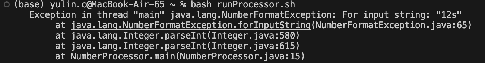

# Lab Report Part 1 - Debugging Scenario on EdStem

Scenario Setup:

Files Involved:

Java File:  NumberProcessor.java

Bash Script:  runProcessor.sh

Input File: 

numbers.txt


## Original Post by Student on EdStem:

Title: Trouble Running Java Program with Bash Script

Hey everyone,

I'm having some issues with my Java program when I try to run it through a Bash script. The Java program is supposed to read numbers from a file and calculate their sum, but I'm getting an odd output. Here's a screenshot of what I'm seeing:



I think the bug might be related to the way numbers are being read from the file. Does anyone have any ideas?

## TA Response:

Hi,

The error suggests that there's an issue with the input data being processed. Could you check the contents of your numbers.txt file? Also, try running your Java program directly with java NumberProcessor and see if you get the same error. This can help us isolate if the issue is with the Java program or the Bash script.

## Student's Follow-up Post:

Thanks for the suggestion! I checked the numbers.txt file and there is an error text inside of it! After fixing that I ran the Java program directly. Here's what I got:


It worked perfectly fine, thank you so much!

## Information of the Set Up:

### File & Directory Structure Needed:
NumberProcessor.java (Java source file)

numbers.txt (Input data file)

runProcessor.sh (Bash script to compile and run the Java program)

#Contents of Each File Before Fixing the Bug:

1.NumberProcessor.java:

```
import java.io.*;
import java.nio.file.*;

public class NumberProcessor {
    public static void main(String[] args) {
        try {
            long sum = 0;
            Path path = Paths.get("numbers.txt");
            for (String line : Files.readAllLines(path)) {
                sum += Integer.parseInt(line.trim());
            }
            System.out.println("Total Sum: " + sum);
        } catch (IOException | NumberFormatException e) {
            e.printStackTrace();
        }
    }
}
```
2.numbers.txt

```
10
15
20
12s  // Non-numeric value causing NumberFormatException
```

3.runProcessor.sh

```
#!/bin/bash
javac NumberProcessor.java
java NumberProcessor
```

### Full Command Line to Trigger the Bug:

Run the Bash script to compile and execute the Java program:
bash

```
bash runProcessor.sh
```

### Description of What to Edit to Fix the Bug:

The bug is caused by a non-numeric value ('12s') in the numbers.txt file, which the Java program attempts to parse as an integer, leading to a NumberFormatException.

To fix the bug, you need to edit the numbers.txt file to ensure it only contains valid numeric values. Specifically, remove or correct the invalid entry 12s to a valid integer. For example, change 12s to 12.

After making this correction, rerun the runProcessor.sh script, and the Java program should execute correctly, calculating and displaying the total sum of the numbers in the file.

This setup and resolution guide provides a clear pathway for identifying and fixing a common type of error encountered in programming, highlighting the importance of data validation and error handling in software development.

# Lab Report Part 2 - Reflection

Expanding on my learning experience in the second half of this quarter, I delved deeper into the Unix command line, uncovering its profound impact on my approach to programming and problem-solving. Before this, my interaction with Unix was rudimentary, often limited to basic file navigation and editing. However, through the labs, I began to appreciate the nuanced capabilities of these tools.

For example, the grep command transformed the way I handle large sets of data. I learned to efficiently search for specific patterns within files, a skill that proved invaluable when sifting through extensive codebases or logs to pinpoint issues. This not only saved time but also introduced a level of precision in debugging that I hadn't experienced before.

Furthermore, my understanding of remote server interaction deepened significantly. Using ssh to securely connect to and work on remote servers was a concept I knew in theory but hadn't practiced much. The labs provided a hands-on opportunity to use ssh in real-world scenarios, enhancing my grasp of distributed development environments and the importance of secure connections.

The use of vim also stood out. Initially, it seemed daunting with its unique keybindings and modes. However, as I used it more, I began to appreciate its power and efficiency for code editing, especially when working remotely or on servers where graphical text editors are not available.

Lastly, engaging with tutors and classmates opened my eyes to the collaborative nature of software development. I learned new tricks and shortcuts from peers, which often led to discussions about best practices and alternative methods. This collaborative learning environment was not just about sharing knowledge but also about understanding different perspectives and approaches to problem-solving in software development.

In summary, the second half of this quarter was a journey of expanding my technical knowledge, especially around Unix tools, and understanding the collaborative, interconnected nature of the software development process. This experience has made me a more versatile and efficient developer, and has sparked a continuous desire to learn and explore more in this field.
